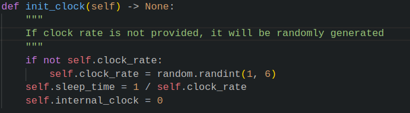
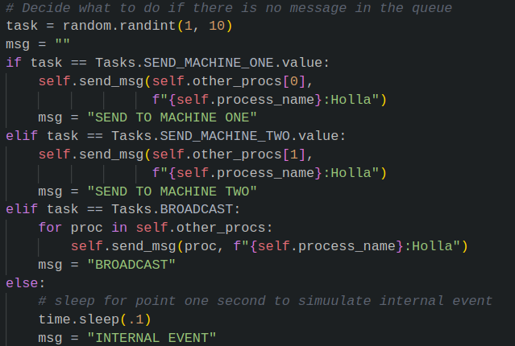
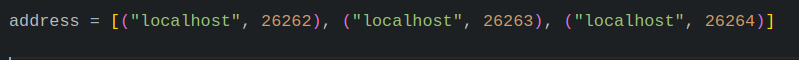

# SMAD

SMAD is a `sm`all,`a`synchronous `d`istributed system that is meant to simulate logical clocks in large distirbuted system.
The model runs on a single machine and simulates multiple machines running at different speeds, each with its own logical clock.
The model allows messages to be passed between the virtual machines using a network queue and profiles different paramters like
`Message queue built ups`, `response times`, `clock gaps` and so on.

## Installation & Usage

To install this program, and run it in your computer you will need a python interpreter. This code was tested with version 3.9, but other versions between 3.8.

First download this repositry with

`git clone https://github.com/hileamlakB/SMAD`

You should then install the reqruiments. To do so, we suggest you create a virtual environment, but we will leave the decision to you. Once you have your envrionment setup you can run

`cd SMAD`

`python -m pip install -r requirements.txt`

Now, you can run the test to make sure everything is working properly. If you are on a \*unix based system, you can run

`./run_test.sh`

To start a simulation, you can

`python src/simulate.py`

which will generate a log file containing events and internal clocks for each of the processes you created. You can interrupt the simulation with a `SIGINT`. To visualize this process you can run

`python experiment\ results/visualize_results.py clock_rates.log [process_name.log] -o experiment\ results/standard_1.png`

Here make sure to include all the process logs, but no more as error handling isn't built it, this should give you a graph like the following,

After each test, make sure you run 

`./clean.sh`

before you run further experiments other wise the data from different tests will overlap.

## Futher experimentation

To futher explore this model, you can tweak up a couple of things.

1. The clock rate of each process
   
2. The number of internal operations each process does compared to communication
   To change this you can access the following part of the code,
   
3. The number of processes
   

For more tests and results, you can look in the engineering notbook inside docs

## License

This project is licensed under the MIT License. See the LICENSE file for more information.
