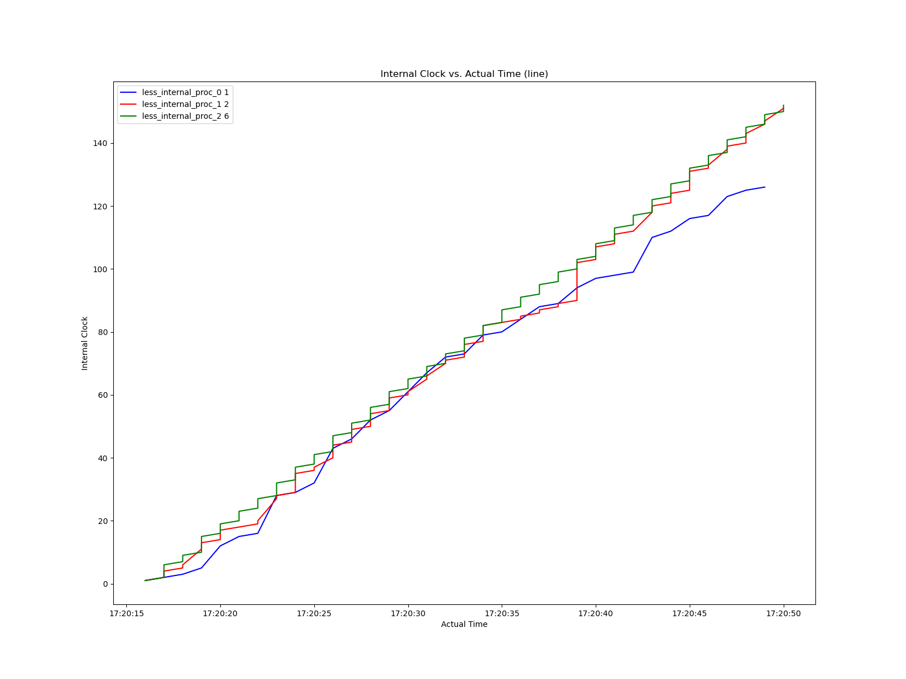

## Introduction

This engineering notbook is developed along side the development of this project to keep track of the programmers mind state. If in the future, there is to be a bug or people (mostly myself) find this repository intersting they can look at the things that were going through the authors mind. As this is a scratch book, there isn't much of a structure and format to it, but I will try to but meaningful headers and subscections as much as possible.

## Brain storming

##### Random Implementation details

- I should have a processor class with the following methods

  - Send a message
  - Receive a message
  - Sleep

- This class should be initialized with properties like

  - clock rate - the number of operations a function will execute per second
  - port ad socket - each model process should have a socket opened ready for sending and receiing messages atleast from 50 other process,
  - logical clock
  - List of other process to send messages to
  - A file discriptor to a log clock updates

- I can either make a process brodcast a message or send to a few random process: in the spec it is required to send to one machine at random
- The queue should be running in a thread so that it isn't blocked when a process is sleeping, I don't think that is the case any ways but I will have to make sure.
- There should be a master program starting all the processes and introducing them to the other process

##### Testing

- I should have a unit test ot the class for its different methods inclusind a doc string before I implement the code like last time.
- Write the unittest after I write the structure and the doc string and then the test before the actual implementation.
- I should also have a test after impleementation is compelete to test implementation detials that were unforseen.

##### Future improvments

- Add support to do spcialized tasks like matrix multiplication to add some cool usecase to the proojects

##### Current Todos

1. Structure unit test
2. Read the time paper again
3. Write a short article on the time paper
4. Read the paper on wruting unit tests
5. Write strucute and unit tests
6. Write unit tests

## Coding

To make testing easier, for isntance to test the logging function, I found it important to isolate the logger from the actual class, and thus I have decided to create a special class called FileLogger. This is called `dependency injection`. It is something cool I learned.

This dependancy class will have the following methods, logs, close and read.

## Socket implementation

When implementing the socket connection between the process I found two options

1. Each process maintians multiple client sockets for each of the other processes so that it doesn't have to deal with the overhead of deleting and creating a new socket each time it wants to send a message. The down side is in a scalable system if there are multiple processes this will require maintaining multiple sockets, which might not be possible as there are limits to the number of open sockets an os can support. ulimt -n gives the maximum number of file discriptors in linux which will be required by sockets.
2. ible as there are limits tEach time process wants to send a message, it just creats a socket and delets it as soon as it is done. The upside, scalable, interms of number of sockets. And easy mentenance. The downside for a small simulatino like ours the overhead of destorying and creating clients everytime might be noticable.

## `:lightbulb:`Cool ideas

- To have actuall parallelism, write the processes models in python and implement the orcester program in c using the pthread liberary

## Experiments

After implementing the the small scallable distirbuted system, here are some of the tests I run.

1. **The standard test**: This test keeps all the paramaters as defined in the problem.The clock rates of the processes is between 1 and 6. There are only 3 processs and 70% of the time each process will be doing an idle task. Running this test 3 times generated the following graphs, the legened shows the name of the process along with its clock ratee.

   

   

   

2. **Inreased Communication Rate**: In the next batch of experiments, I kept everything the same but I decreased the percentage of time this process spend doing internal work to 10%. This would allow the systems to communicate very often and thus we excpect them to have close clocks throughout despite different clock rates.

   

   

   

3. **Decreased Communication rate:** For this next experiment, I have decreased the communication rate to only 15% and the internal work to 85% whilke keeping the number of process at the same value and here are the results.

   

   

4. **Increased Clock Rate:** In this experiment we have increased the range of the clock rate from [1,6] to [1,20] and this is the result we have found

   

   

   

5. **Small clock rates, bigger numbers, smaller internal task time**: In this batch of experiments, I keept the clock rates fairly small, I have a good number of process and the kept the clock rate constant at either 1 or 2, a rather small clock rate, and here are the results I found.

   Note: Here, the experiment is a bit skewed as the tasks performed by a each process are still the same as the once done by a three process system. That is the the only tasks available for a process are

   1. send message to the top process
   2. send message to the second top process
   3. brodcast message to everyone
   4. twiddle
   5. read messages
      Thus two process might get a relatively increased amount of process compared to the rest as everyone sends a message to them, but the result is still intersting with a bit of cluster forming as the top process are busy recieving messages and don't have to send message to the other cluster

   

   

6. **Bigger clock rates, bigger numbers, smaller internal task time**: This experiment has the same setup as the previous one with the clock rate being the only changed feature, here the clock rate is allowed to range between [1,20].

   

   Thsi result it yet intersting. Because the top process are busy reading messages, they don't have time to send message to help the other process update their time. So the above cluster of graphs each runnig at their respecitve clock is foremed. This graphs has a rather constantly increasing gap between each of the processes.

7. **Large numbers, bigger in internal tasks, small clock**
   Another intesting experiment witht the same setup as 5, with internal tasks a good chunk of each processes time.

   

   **An even smaller clock:**

   

8. **BIGGER, BADDER:** with all number, internal task and clock rate set to large

   

   

**TODOS**:
Give a three triangle relation between

1. clock rate
2. number
3. Communication rate

## Experiment Conclusion
